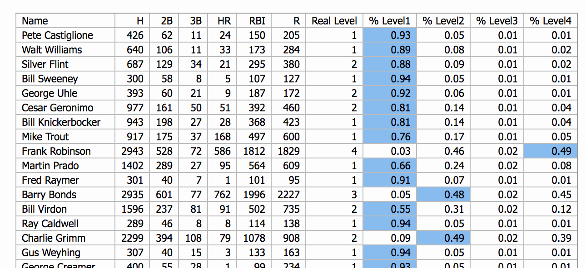

### TensorFlow MLB Batting
TensorFlow NN for classifying batters.

### Method
Players need at least 1000 at bats and are divided among 4 levels.
- 4: HoF
- 3: Not in HoF but had received at least 20 percent
- 2: Was on HoF ballot
- 1: None of the above

#### Observation and notes
This is just an experiment for fun and not a serious attempt to train a machine to classify MLB players. The ranking levels are somewhat arbitrarily chosen, as are the features used in the training. Also known data issues are not dealt with - for example: I ignored the fact that pitchers can have batting stats, and some HoF pitchers are horrible batters, this can create unpleasant outliers in training data. Inherent politics like banned players, and yet to be eligible players also create noises in the data.

Overall accuracy is around 80%. Level 3 turned out to be a bad category, as only around 40 out of over 3000 players fit into the classification, and subjectively, there is not a huge difference between those in level 2 and level 3.

#### Dependencies
Requires `tensorflow`, `numpy`, and `flask`.

#### Training and running
- In data folder, run `download-data.sh` to fetch data
- In root folder run `python mlb.py`, then go to http://localhost:5000

#### Data
Data source is https://github.com/chadwickbureau/baseballdatabank/
